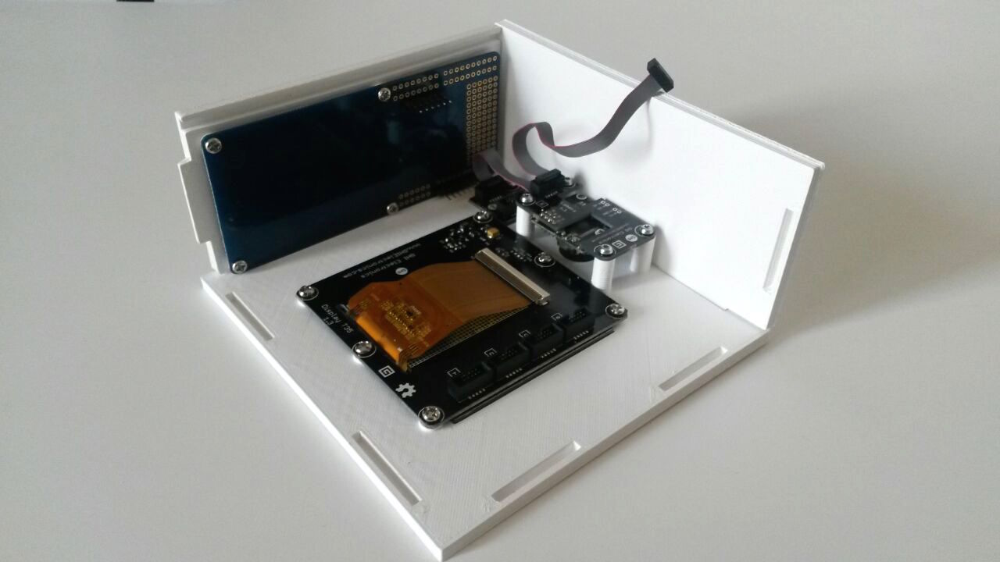

# NFCAuthentication

Develop an authentication mechanism that uses an NFC card and a user personal PIN. A secure communication with a Web Service is used to check the provided credentials.

2015, Project and Laboratory on Comunication System. Prof: Guido Albertengo

Authors: Vincenzo Costanzo, Antonio Leo, Andrea Marcelli, Sebastiano Miano

## Components

* FEZ Spider Starter Kit
* PN532 NFC/RFID Controller Shield
* 3D printed Box

